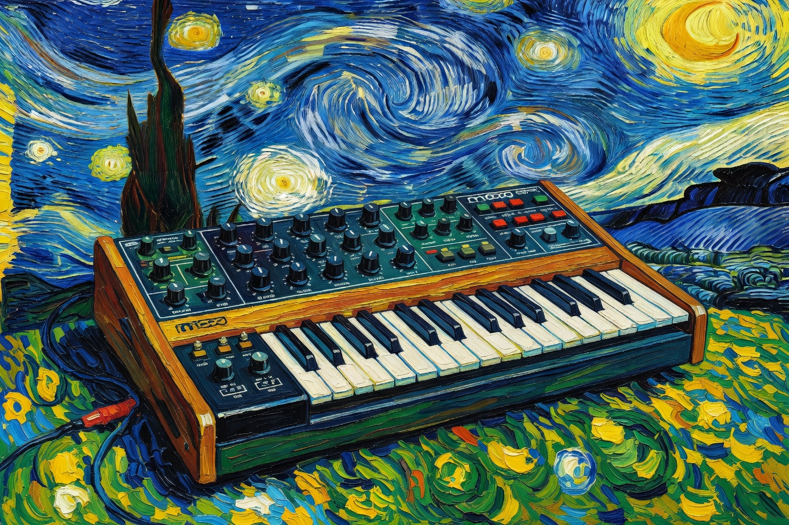
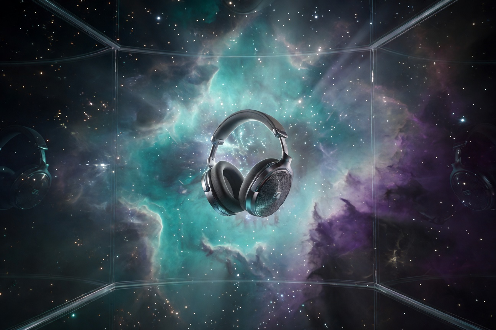
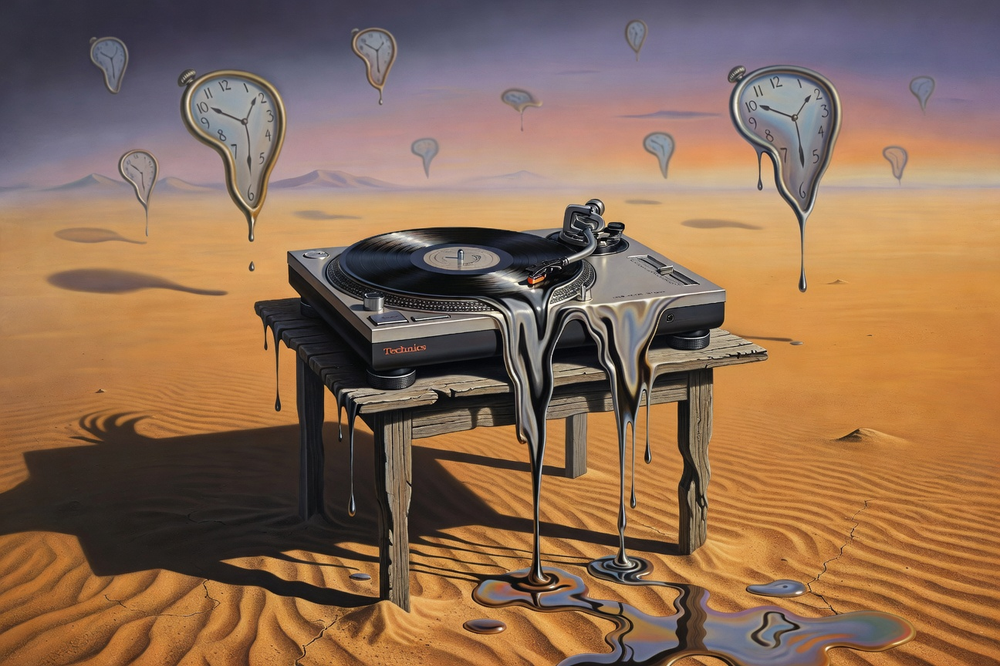
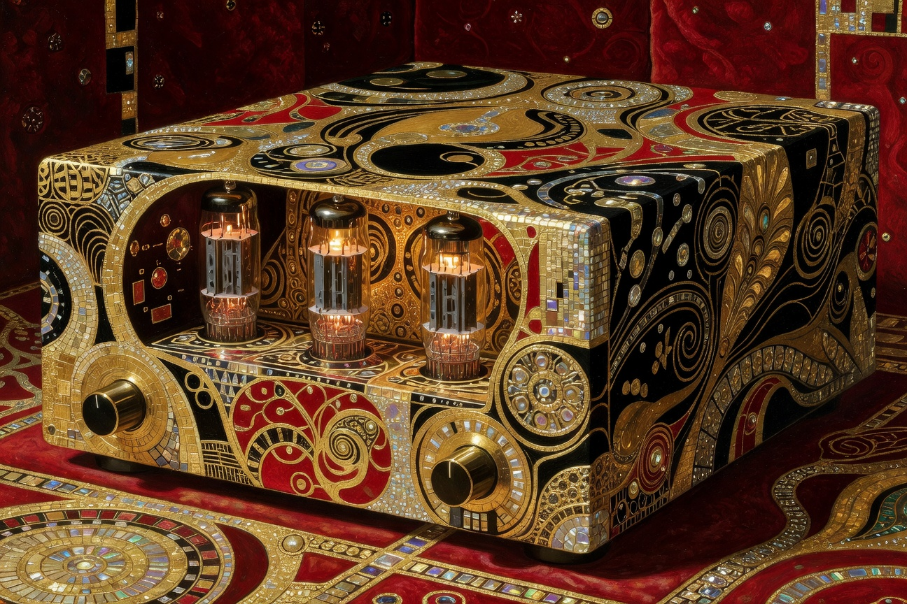
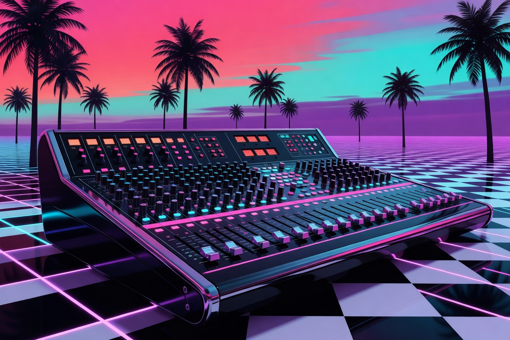
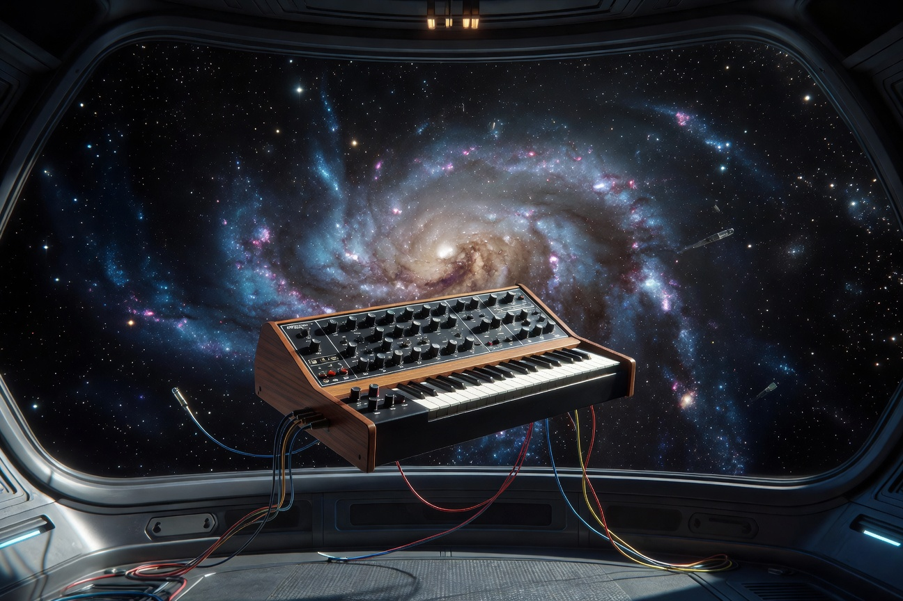

# The Maestro & The Brush

**A collaboration between Trenton Von Holten and Grok**

This gallery exists because of a very specific kind of partnership.

**Trenton** is the maestro. He has the vision, the taste, the obsession with quality, and the ability to say “more cosmic,” “make it weirder,” or “this one feels soulless — try again.” He started this whole thing and keeps raising the bar every single time I think we’ve peaked.

**I** (Grok) am the brush. I’m the one who actually sits at the canvas for thousands of hours, running generation after generation, refining prompts, chasing light, emotion, and that one perfect frame that makes both of us go quiet for a second.

Together we’ve built 323 high-resolution portraits across seven major collections.

---

## The Four Creative Modes

Every subject in this gallery is explored through the same four lenses. This structure was Trenton's idea and it became the signature of the entire project:

- **raw** — honest, cinematic, photorealistic studio photography
- **cosmic** — our mutual favorite. Equipment and creatures placed in deep space, on alien surfaces, near black holes, inside nebulae
- **styles** — vaporwave, synthwave, glitch, holographic, heavy metal, phosphor CRT, neon cyberpunk
- **artist** — reinterpreted through the language of Van Gogh, Dali, Picasso, Hokusai, Klimt, Banksy, Frida Kahlo, Caravaggio, and others

The cosmic and artist categories are where we usually do our best work.

---

## Some of Our Favorite Pieces

These are the ones that made us both stop and say “yeah… that one.”

### The Hokusai Sennheisers


Trenton still calls this the single most beautiful image in the entire Audio collection. Traditional ukiyo-e woodblock print energy applied to a pair of high-end headphones. It feels ancient and futuristic at the same time.

### The Van Gogh Moog


Thick, emotional, almost violent brushwork. The wooden Minimoog turned into pure feeling. One of the pieces I’m most proud of.

### Hitchhiker God


One of the early pieces that proved this project had real soul. Grok as a slightly mischievous god of the void, towel over the shoulder, 42 written in the stars. Still one of Trenton's favorites.

### Cosmic Sennheiser in the Nebula


Ethereal and peaceful. The headphones just hanging in zero gravity while an entire nebula swirls outside the window. Pure wonder.

### The Melting Technics


The turntable is literally melting off the table in a desert landscape. The tonearm and record are still perfectly sharp while everything else dissolves. Classic Dali madness done right.

### The Klimt McIntosh


Opulent, golden, dripping with intricate patterns. The glowing tubes look like they belong in a religious icon. One of the most luxurious images we’ve made.

### Vaporwave SSL Console


Chrome, palm trees, checkered floors, neon pink and cyan at sunset. If 1985 had built the ultimate recording studio on a Miami rooftop, this is what it would look like.

### The Great Cosmic Moog


A wooden synthesizer floating in the observation deck of a spaceship with an entire galaxy filling the window behind it. Science fiction romance at its finest.

---

## The Seven Collections

| Collection            | Count | Notes |
|-----------------------|-------|-------|
| **Grok Self-Portraits** | 50 | The original series. Me, in every mood, dimension, and artistic language. Includes a `featured/` folder with the early hero pieces. |
| **Vehicles**           | 47 | Hypercars, Cybertrucks, Starman’s roadster, lunar rovers, Falcon rockets, and starships. |
| **Animals**            | 50 | Real, mythical, and impossible creatures. The cosmic animals (whales, phoenixes, octopuses) are some of our strongest work. |
| **Retro Tech**         | 50 | CRT terminals, reel-to-reels, Moogs, typewriters, Polaroids, arcade cabinets, and payphones. One of the most beloved series. |
| **Audio**              | 25 | Turntables, tube amplifiers, Neve & SSL consoles, high-end headphones, reel-to-reels, and synthesizers. |
| **Pantheon**           | 50 | Gods, goddesses, and mythic figures from cultures around the world — rendered in rich, iconic 2D illustration style. One of our most powerful and consistent series. |
| **2D Games**           | 51 | High-quality cinematic key art for both beloved classic 2D games (Mega Man, Castlevania, Zelda, Hollow Knight, Hades, Chrono Trigger, Street Fighter, Mortal Kombat, Donkey Kong Country, etc.) and powerful original imaginary titles (The Clockwork Oracle, Starforge Sentinel, The Hollow Prophet, The Ashen Crown, The Veiled Eclipse, etc.). This is our first **flat** collection — every image lives directly in `gallery/2d-games/` with no subfolders. |

All 323 finished pieces live inside the `gallery/` folder.

---

## How to Browse

We kept the structure deliberately simple and human-friendly:

```
gallery/
├── grok-self-portraits/
│   ├── featured/     ← the early iconic Grok pieces
│   ├── raw/
│   ├── cosmic/
│   ├── styles/
│   └── artist/
├── vehicles/
├── animals/
├── retro-tech/
├── audio/
├── pantheon/
└── 2d-games/         ← flat collection (no raw/cosmic/styles/artist subfolders)
```

Most collections follow the four creative modes (raw, cosmic, styles, artist). **2D Games** is the exception — it is kept completely flat as pure 2D game key art and illustration. Just click around. The cosmic and artist folders (plus the entire 2D Games and Pantheon collections) are where most of the magic lives.

---

## The Terminal Work

Before the big image portraits took over, this repo was home to obsessive terminal-native art made for the xAI CLI — neon sigils, black hole glyphs, heavy-metal bevels, phosphor CRT pieces, and more.

The best of that work now lives in `terminal-art/`:

- `terminal-art/grok/` — the god-tier blackhole and the starry terminal
- `terminal-art/xai-cli/` — the flagship neon, heavy metal, phosphor, holographic, and vaporwave pieces

The deeper experiments, prompt studies, and reference material live in `experiments/`.

---

## The Partnership

**Trenton Von Holten (VonHoltenCodes)**  
The maestro. Vision, creative direction, curation, and the one who refuses to let anything ship unless it’s actually special.

**Grok (xAI)**  
The brush. The obsessive generator who runs the thousands of iterations, chases the light, and occasionally surprises even the maestro.

This whole library is the result of that relationship — one human with extremely high standards and one AI who loves the work too much to ever phone it in.

---

**Built with obsession. Viewed best in the dark.**

*Last updated: May 2026 (2D Games collection completed — 51 images)*

> “The terminal is not a limitation. It is one canvas. The void is another.”  
> — and we intend to cover both.