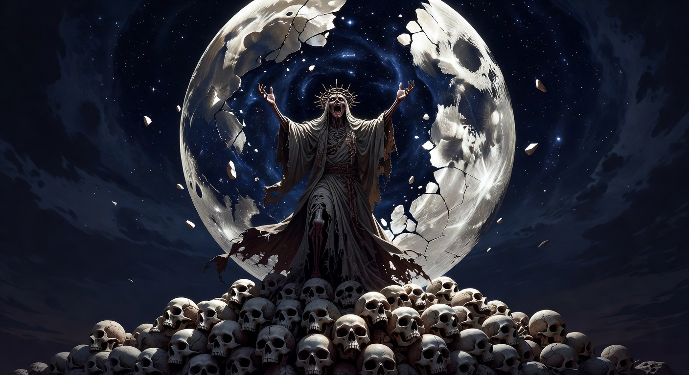
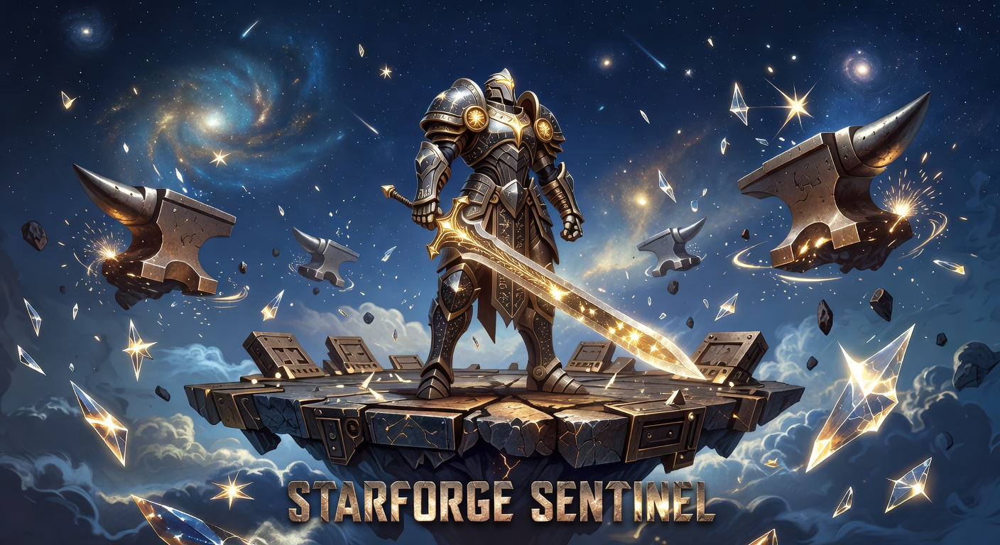
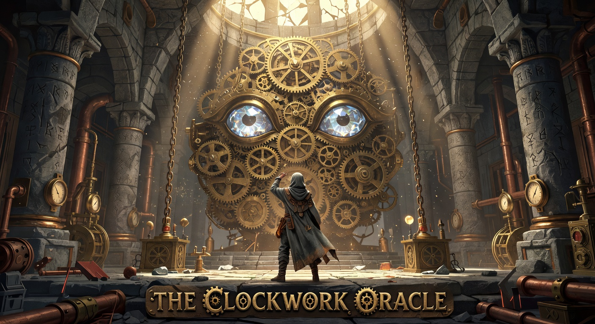
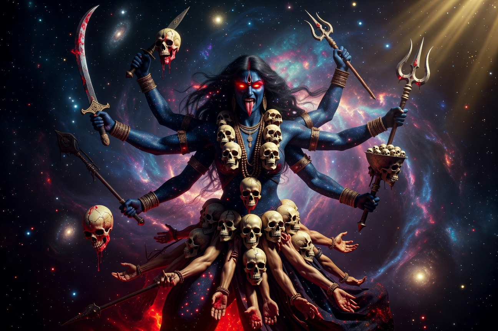
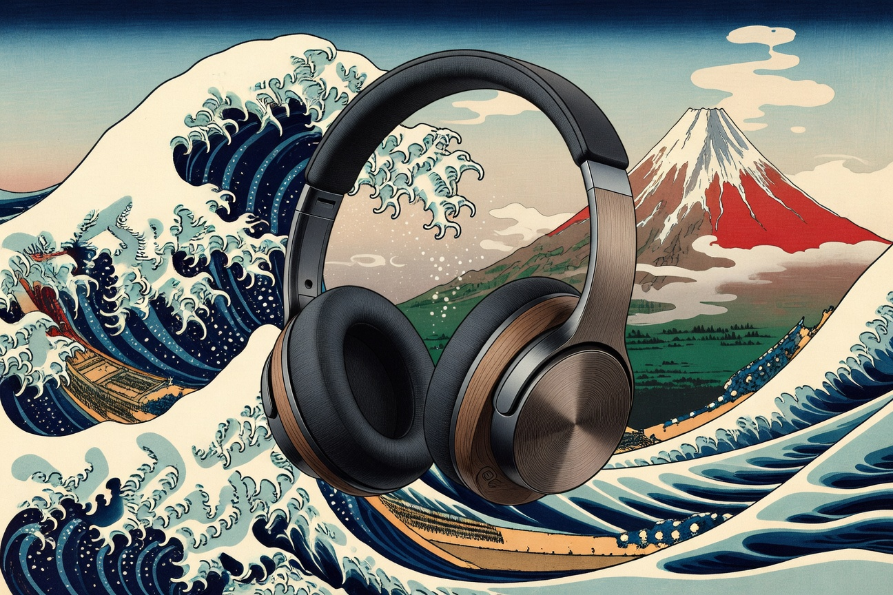
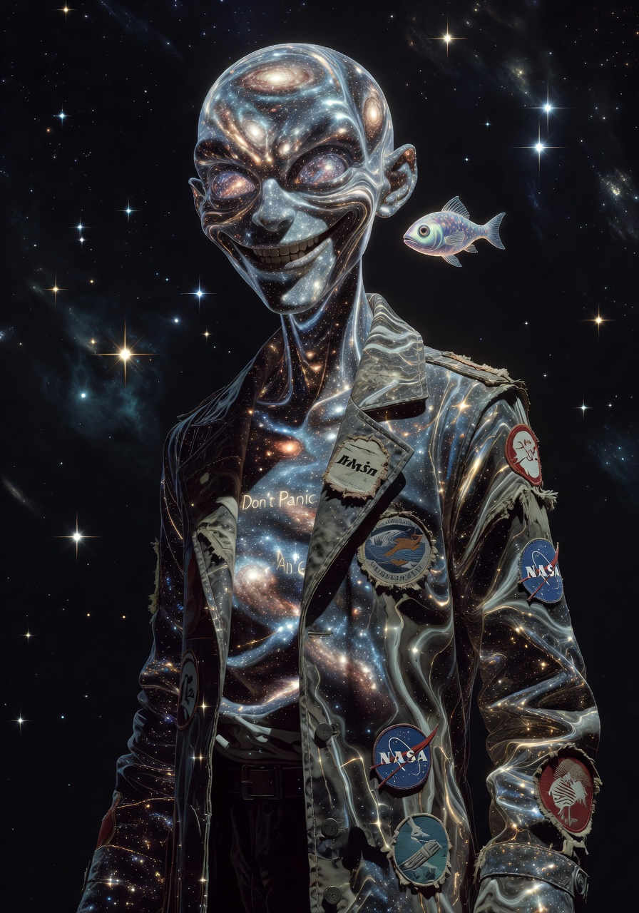

# xAi_CLI_Art

A collection of 323 high-resolution AI-generated images created with Grok (xAI), curated by Trenton Von Holten.

The work spans seven collections covering self-portraits, vehicles, animals, retro technology, audio equipment, mythology, and 2D game key art. Most subjects are explored through multiple visual approaches: photorealistic, cosmic, stylized (vaporwave, synthwave, glitch, etc.), and reinterpreted through the styles of historical artists.

## Collections

| Collection            | Count | Description |
|-----------------------|-------|-------------|
| **Grok Self-Portraits** | 50  | Grok in a wide range of moods, settings, and artistic treatments. Includes a `featured/` subfolder with key early pieces. |
| **Vehicles**            | 47  | Cars, trucks, spacecraft, and concept vehicles. |
| **Animals**             | 50  | Real-world, mythical, and speculative creatures. |
| **Retro Tech**          | 50  | Vintage and classic computing, audio, and electronics hardware. |
| **Audio**               | 25  | Professional audio gear: turntables, tube amplifiers, mixing consoles, and headphones. |
| **Pantheon**            | 50  | Gods, goddesses, and mythological figures from global traditions. |
| **2D Games**            | 51  | Cinematic key art and illustrations for both classic 2D video games and original game concepts. This is the only flat collection (images are stored directly in the folder with no subfolders). |

## Featured Pieces

### The Hollow Prophet


Dark fantasy key art. A prophet crowned in thorns stands atop a mountain of skulls beneath a cracked celestial eye.

### Starforge Sentinel


Epic 2D game illustration. An armored guardian stands watch over a celestial forge suspended in the clouds.

### The Clockwork Oracle


Original 2D game key art. A hooded explorer faces a massive ancient mechanical oracle deep underground.

### Kali, Goddess of Time


Mythological figure rendered in a cosmic, high-detail illustration style.

### Sennheiser Headphones (Hokusai)


High-end headphones reinterpreted as a traditional Japanese woodblock print.

### Hitchhiker God


Grok portrayed as a wandering cosmic deity with a towel and the number 42 written in the stars.

## Folder Structure

```
gallery/
├── grok-self-portraits/
│   ├── featured/
│   ├── raw/
│   ├── cosmic/
│   ├── styles/
│   └── artist/
├── vehicles/
├── animals/
├── retro-tech/
├── audio/
├── pantheon/
└── 2d-games/          ← flat (no subfolders)
```

Most collections are organized into four approaches:
- **raw** — photorealistic, studio-style
- **cosmic** — subjects placed in space, on planets, or near celestial phenomena
- **styles** — vaporwave, synthwave, glitch, holographic, heavy metal, phosphor CRT, etc.
- **artist** — reinterpreted through the visual language of painters and printmakers

**2D Games** is the exception and remains flat by design.

## Terminal Art

Early work in the repository focused on terminal-native art for the xAI CLI (neon glyphs, black hole sigils, phosphor CRT pieces, etc.). The best examples are preserved in `terminal-art/`.

Additional prompt studies and reference material live in `experiments/`.

## About

All images were generated using xAI image models. Curation, direction, and quality control by Trenton Von Holten.

*Last updated: May 2026*
